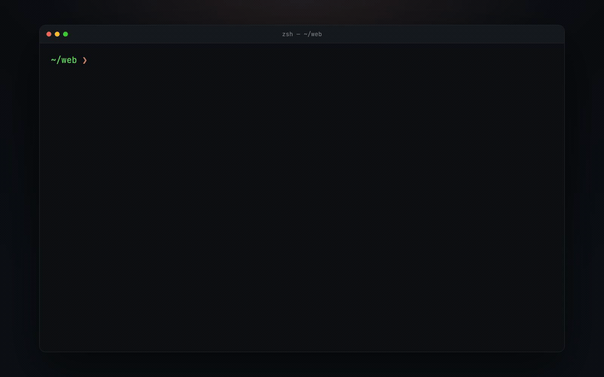
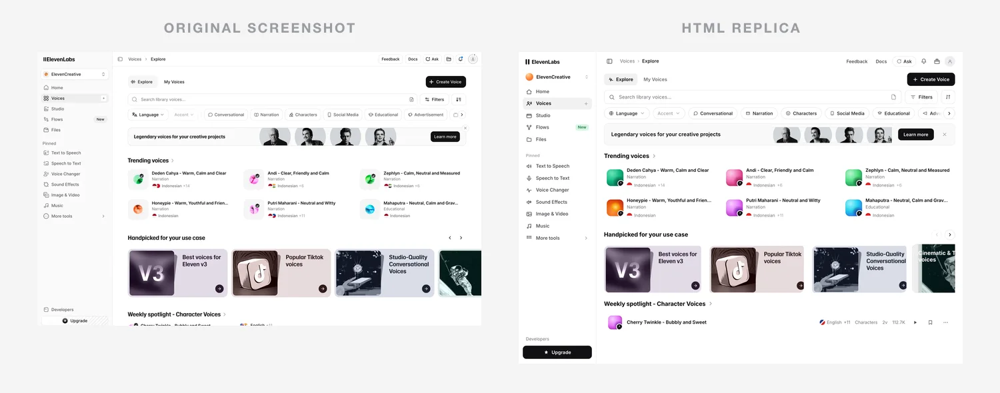

<sub>🌐 English · <a href="README.zh-CN.md">中文</a></sub>

<div align="center">

# screenshot-to-html

**Drop a screenshot — get back a pixel-faithful, fully interactive single-file HTML page.**

[](https://skills.sh)
[](#install)
[](#under-the-hood)
[](LICENSE)
[](https://github.com/sevzq/screenshot-to-html/stargazers)

<br>

An AI coding-agent skill that rebuilds any UI screenshot as **one clean, self-contained, interactive HTML file**. Not a one-shot guess — a **render → screenshot → compare → refine loop** in real Chrome, until `render(code) ≈ target`. Then it wires up real hover / focus / click states and **verifies them headless**.

```
npx skills add sevzq/screenshot-to-html
```

Works in **Cursor · Claude Code · Codex · Windsurf · Copilot** — and 40+ agents.

[Gallery](#gallery) · [Install](#install) · [How it works](#how-it-works) · [Why it's different](#why-its-different)

</div>

---

<p align="center">
  
</p>

<p align="center"><sub>
  ▲ Install the skill, open <b>Claude Code</b> (or Cursor / Codex), paste a screenshot, type one line — the skill writes a single <code>output.html</code> and <b>verifies the interactions in real Chrome</b>.
  &nbsp;·&nbsp; <a href="assets/hero.mp4">Hi-res MP4</a>
</sub></p>

---

## Gallery

Real app screenshot (left) vs the generated **single-file HTML replica** (right). Every replica below was produced by the skill, is a single file with inline CSS/JS (no framework, no build step), and passes `node scripts/shot.mjs --verify`. Full sources in [`examples/`](examples/).

### Featured — full app UIs, fully interactive

**ElevenLabs — Voices library**

[](examples/app-elevenlabs/output.html)

A light Voices / Explore workspace: sidebar, Explore / My Voices tabs, filter chips, a 3×2 trending grid, a drag-snap "Handpicked" carousel, and the weekly spotlight. Voice avatars are layered CSS gradients and icons are inline SVG; only the card artworks are cropped.
[Source](examples/app-elevenlabs/input.png) · [HTML replica](examples/app-elevenlabs/output.html) · [▶ Live demo](assets/elevenlabs-demo.gif)

**Spotify — web player (dark)**

[](examples/app-spotify/output.html)

A dark three-pane player; every cover is real imagery cropped from the source, all icons inline SVG. Rows reveal a play glyph on hover, the transport (play / shuffle / repeat) toggles, the now-playing panel collapses, and volume is a real slider.
[Source](examples/app-spotify/input.png) · [HTML replica](examples/app-spotify/output.html) · [▶ Live demo](assets/spotify-demo.gif)

**Airbnb — iOS app (mobile)**

[](examples/mobile-airbnb/output.html)

Authored at 393px @3x in a decorative iPhone frame. Every listing card is a swipeable photo carousel (drag, velocity snap, dot indicators, hover arrows), the hearts toggle with a tactile pop, and the bottom tab bar switches screens — all with zero dependencies.
[Source](examples/mobile-airbnb/input.png) · [HTML replica](examples/mobile-airbnb/output.html) · [▶ Live demo](assets/airbnb-demo.gif)

### More examples

<table>
<tr>
<td width="50%" valign="top">

**Cloudflare — landing page**

[](examples/landing-cloudflare/output.html)

Giant black-and-orange headline and full nav in pure CSS; only the geodesic sphere is cropped from the source.
[Source](examples/landing-cloudflare/input.png) · [HTML](examples/landing-cloudflare/output.html)

</td>
<td width="50%" valign="top">

**Modal — landing page (dark / neon)**

[](examples/landing-modal/output.html)

A pure-black hero with a spring-green accent; the glowing cube is `screen`-blended onto the black so there's no seam.
[Source](examples/landing-modal/input.png) · [HTML](examples/landing-modal/output.html)

</td>
</tr>
<tr>
<td width="50%" valign="top">

**Clay — landing page (colorful)**

[](examples/landing-clay/output.html)

A cream hero on white with a huge display headline; four clay sculptures are `multiply`-blended across the panel edge.
[Source](examples/landing-clay/input.png) · [HTML](examples/landing-clay/output.html)

</td>
<td width="50%" valign="top">

**Stripe — landing page**

[](examples/landing-stripe/output.html)

The diagonal gradient and multiply-blended headline are pure CSS; only the checkout/dashboard cluster is cropped. Working email field.
[Source](examples/landing-stripe/input.png) · [HTML](examples/landing-stripe/output.html)

</td>
</tr>
<tr>
<td width="50%" valign="top">

**Tesla — charging screen (iOS)**

[](examples/mobile-tesla/output.html)

393px @3x in an iPhone frame; the Model 3 render is color-matched to the screen. The charge-limit slider is a real `range` input.
[Source](examples/mobile-tesla/input.png) · [HTML](examples/mobile-tesla/output.html)

</td>
<td width="50%" valign="top">

**Stripe — dashboard**

[](examples/dashboard-stripe/output.html)

Rebuilt entirely as code (inline-SVG charts, CSS bars), zero crops. The sidebar nav, Test-mode switch, and date pills all respond.
[Source](examples/dashboard-stripe/input.png) · [HTML](examples/dashboard-stripe/output.html)

</td>
</tr>
<tr>
<td width="50%" valign="top">

**Linear — landing page**

[](examples/landing-linear/output.html)

Hand-built HTML/CSS; only the product-UI card is lifted from the source. Nav + Sign-up have hover/focus and links smooth-scroll.
[Source](examples/landing-linear/input.png) · [HTML](examples/landing-linear/output.html)

</td>
<td width="50%" valign="top">

**More in [`examples/`](examples/)**

Each folder ships the source screenshot, the single-file `output.html`, and a side-by-side `comparison.webp`. New replicas welcome via PR.

</td>
</tr>
</table>

> Like what you see? **[⭐ Star the repo](https://github.com/sevzq/screenshot-to-html)** — it helps others find it.

## Why it's different

Most "screenshot to code" tools generate once and stop. `screenshot-to-html` optimizes what you actually *see* — and what you can actually *click*:

- **Pixel-faithful by loop, not luck** — it screenshots its own output with real Chrome and diffs against your image region-by-region (layout → spacing → color → type → polish), refining until it matches. Semantic HTML + design tokens, not absolute-positioned magic numbers.
- **Actually interactive — and verified** — real `<button>` / `<a>`, hover / focus / active states, working tabs, nav, and carousels where the screenshot implies them. Audited with `shot.mjs --verify`, which fails the build on dead controls.
- **One self-contained file** — inline CSS/JS, zero dependencies, zero build step. Open it anywhere.
- **Sharp assets, automatically** — every image slot is filled by what looks best: a crisp crop from your screenshot, an official logo SVG, or a real stock photo — never a blurry stand-in or an AI-slop silhouette.
- **Real size & responsive** — authored at the true design width with fluid units (`clamp()` / `max-width`), so it opens correctly at 100% zoom and adapts. Never a fixed miniature.

## How it works

```
Phase 0  Setup        — inputs, stack, and the true design width / scale
Phase 1  Read         — design tokens, layout intent, exact text
Phase 2  Build        — a semantic, self-contained first draft
Phase 3  Loop         — shot.mjs → compare to target → fix   (repeat 2–4×)
Phase 4  Interact     — real hover / focus / active states, then --verify
Phase 5  Final checks — responsive, exact text, fidelity
Phase 6  Motion       — optional, only if you ask
```

The render step uses [`scripts/shot.mjs`](scripts/shot.mjs), which drives your installed Chrome via `playwright-core` (no browser download). The same script audits interactivity (`--verify`) and captures hover / focus / open states (`--hover` / `--focus` / `--click` / `--states`).

## Install

### npx skills (recommended)

Auto-detects your agent (Cursor, Claude Code, Codex, Windsurf, Copilot, 40+):

```bash
npx skills add sevzq/screenshot-to-html
```

### Cursor

**Settings → Rules → Add Rule → Remote Rule (GitHub)** → `sevzq/screenshot-to-html`, or just use `npx skills add` above.

### Other agents (Codex, OpenCode, Gemini CLI, …)

Point the agent at this repo and tell it to use the skill, starting from [`SKILL.md`](SKILL.md):

```text
https://github.com/sevzq/screenshot-to-html
```

<details>
<summary><b>Manual install</b> (clone into your agent's skills directory)</summary>

The repo root *is* the skill:

| Agent        | Skills directory             |
| ------------ | ---------------------------- |
| Claude Code  | `~/.claude/skills/`          |
| Cursor       | `~/.cursor/skills/`          |
| OpenAI Codex | `~/.codex/skills/`           |
| OpenCode     | `~/.config/opencode/skills/` |

```bash
git clone https://github.com/sevzq/screenshot-to-html.git ~/.cursor/skills/screenshot-to-html
```

The render/crop scripts need Node deps once (from the repo root): `npm i` installs `playwright-core`; add `sharp` for cropping with `npm i -D sharp`.

</details>

## Usage

Point your agent at a screenshot and ask it to replicate:

```text
Clone this screenshot into HTML:  ./design.png
```

It reads the design, builds a draft, then loops (render → compare → refine), wires up the interactions, and hands you a single self-contained HTML file plus a side-by-side comparison.

## Under the hood

- **Verified interactivity.** `node scripts/shot.mjs --in page.html --verify` audits the page for dead controls (clickable-looking `<div>`s), missing `cursor: pointer`, and absent `:hover` / `:focus` rules — and reports `WARN` until they're fixed. Interactivity is treated as part of fidelity, not an afterthought.
- **Quality-first assets (automatic).** Each image slot is resolved without asking you, by what looks sharpest and most specific: **assets you supplied** → **official brand SVG/logos** → a **crisp crop** from the source ([`crop.mjs`](scripts/crop.mjs)) → a real [Unsplash](https://unsplash.com) / `picsum.photos` photo → `placehold.co` as a last resort.
- **Motion is opt-in.** Baseline interactivity (hover / focus / active states) ships by default, but animation is **only** added when you explicitly ask — Phase 6 layers in restrained, self-contained GSAP via CDN. See [`references/animation.md`](references/animation.md).

## Star history

<p align="center">
  <a href="https://star-history.com/#sevzq/screenshot-to-html&Date">
    
  </a>
</p>

## Contributing

Issues and PRs welcome — new example replicas especially. See [AGENTS.md](AGENTS.md) for the skill structure and authoring conventions.

## License

[MIT](LICENSE) © SevenZhang

> Example screenshots are real app UIs used for replication demos only; they belong to their respective owners.
