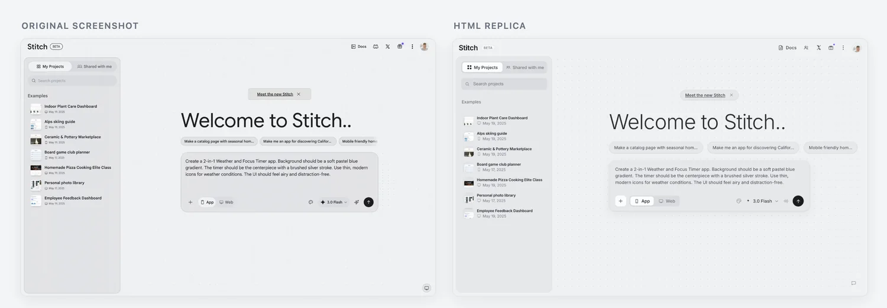

<sub><a href="README.md">English</a> · 🌐 中文</sub>

<div align="center">

# screenshot-to-html

**丢一张截图，拿回一个像素级还原、_还能点_的单文件 HTML 页面。**

[](LICENSE)
[](https://agentskills.io)
[](https://skills.sh)
[](#安装)
[](#实现细节)

<br>

一个 AI 编程 agent 技能，把任意 UI 截图重建成**一个干净、自包含、可交互的 HTML 文件**。不是一次性瞎猜，而是一个**渲染态闭环**：构建 → 用真实 Chrome 截图 → 和你的原图对比 → 修正，直到 `render(code) ≈ target`。然后给它接上真实的 hover / focus / 点击状态，并**用无头 Chrome 验证**。

```
npx skills add sevzq/screenshot-to-html
```

可在 **Cursor · Claude Code · Codex · Windsurf · Copilot** 等 40+ agent 中使用。

[看画廊](#画廊) · [安装](#安装) · [工作原理](#工作原理) · [为什么不一样](#为什么不一样)

</div>

---

<p align="center">
  
</p>

<p align="center"><sub>
  ▲ 一个<b>生成出来的</b> Spotify 复刻页，实时操作 —— 悬停歌曲、切换播放/暂停与随机、收起正在播放面板。就一个自包含 HTML 文件。
  &nbsp;·&nbsp; <a href="assets/hero.mp4">高清 MP4</a>
</sub></p>

> **这篇 README 里的每一个复刻页，都是这个技能自己产出的**，并且用无头 Chrome 验证过「真能点」—— 每个都是带内联 CSS/JS 的单一 HTML 文件，无框架、无构建步骤。

---

## 为什么不一样

大多数「截图转代码」工具生成一次就停了。`screenshot-to-html` 优化的是你**真正看到**、并且**真正能点**的东西：

- **靠闭环还原，不靠运气** —— 它用真实 Chrome 给自己的产物截图，分区域和你的原图对比（布局 → 间距 → 颜色 → 字体 → 细节），不断修正直到吻合。是语义化 HTML + 设计令牌，而不是一堆绝对定位的魔法数字。
- **真的可交互 —— 而且经过验证** —— 真实的 `<button>` / `<a>`、hover / focus / active 状态，以及截图暗示的可用 tab、导航、弹窗。用 `shot.mjs --verify` 审计，发现「死按钮」直接让构建不通过。不是一张假装成页面的静态图。
- **单一自包含文件** —— 内联 CSS/JS，零依赖、零构建，随处可开。
- **素材自动且锐利** —— 每个图片位都用最合适的来源填充：从你截图里裁出的清晰区域、官方 logo SVG、或一张真实的图库照片 —— 绝不用模糊的占位图或「AI 味」的剪影。无需提问、无需手动。
- **真实尺寸、自适应** —— 按真实设计宽度 + 流式单位（`clamp()` / `max-width`）编写，所以 100% 缩放下也正常显示并自适应，绝不是一个固定的「迷你版」。
- **就跑在你已经在用的 agent 里** —— 无需部署 web 应用、无需额外 API key、无需基础设施。它就是一个技能。

## 画廊

左边是真实 App 截图，右边是生成出来的单文件 HTML 复刻 —— 明暗、桌面与移动、落地页、后台、完整 App UI 都有。完整源文件见 [`examples/`](examples/)。每个复刻都可交互，并且通过 `node scripts/shot.mjs --verify`。

### Stripe —— 落地页


[原图](examples/landing-stripe/input.png) · [HTML 复刻](examples/landing-stripe/output.html) —— 斜向渐变和正片叠底标题是纯 CSS；只有浮动的收银 + 仪表盘卡片簇是从原图裁切的。导航、公告 pill、可用的邮箱输入框 + Start now 按钮都是带 hover/focus 的真实控件。

### Spotify —— 网页播放器（暗色）


[原图](examples/app-spotify/input.png) · [HTML 复刻](examples/app-spotify/output.html) —— 暗色三栏播放器；每个封面和专辑缩略图都是从原图裁出的真实图像，所有图标是内联 SVG。完全可交互：歌曲行悬停高亮并出现播放图标，播放控制（播放 / 随机 / 循环）可切换，正在播放面板可收起，音量是真实滑块。_（顶部 Hero 用的就是这个页面。）_

### Airbnb —— iOS App（移动端）


[原图](examples/mobile-airbnb/input.png) · [HTML 复刻](examples/mobile-airbnb/output.html) —— 按 393px @3x 编写并包进一个装饰性 iPhone 外框；房源照片和 3D 分类图标从原图裁切。可交互原型：底部 tab 栏在外框内切换屏幕，Homes / Experiences / Services 顶部 tab 可切换，爱心可收藏。

### Linear —— 落地页


[原图](examples/landing-linear/input.png) · [HTML 复刻](examples/landing-linear/output.html) —— 产品 UI 卡片用 [`crop.mjs`](skills/screenshot-to-html/scripts/crop.mjs) 从原图取出，其余都是手写 HTML/CSS。导航链接和注册按钮有 hover/focus 状态，页内链接平滑滚动。

### Stripe —— 仪表盘


[原图](examples/dashboard-stripe/input.png) · [HTML 复刻](examples/dashboard-stripe/output.html) —— 图表是内联 SVG，堆叠条是 CSS；整屏零图片裁切、纯代码重建。可交互：侧边导航、Test mode 开关、日期/周期 pill 都有反馈，卡片和行悬停高亮。

### Stitch —— 主页



[原图](examples/app-stitch/input.png) · [HTML 复刻](examples/app-stitch/output.html) —— 点阵画布、侧边栏和 prompt 输入区都用 CSS 重建；只有小的项目缩略图从原图裁切。可交互：My Projects / Shared tab 可切换，prompt 是真实 textarea，App/Web 切换可用。

## 工作原理

```
Phase 0  准备     —— 输入、技术栈，以及真实的设计宽度 / 缩放
Phase 1  读设计   —— 设计令牌、布局意图、精确文案
Phase 2  搭草稿   —— 一个语义化、自包含的初版
Phase 3  闭环     —— shot.mjs → 对比原图 → 修正   （重复 2–4 次）
Phase 4  加交互   —— 真实 hover / focus / 可点击状态，再 --verify
Phase 5  终检     —— 自适应、精确文案、还原度
Phase 6  动效     —— 可选，仅当你主动要求
```

渲染步骤用 [`scripts/shot.mjs`](skills/screenshot-to-html/scripts/shot.mjs)，它通过 `playwright-core` 驱动你本机已装的 Chrome（不下载浏览器）。同一个脚本还能审计交互（`--verify`）、抓取 hover / focus / 打开态（`--hover` / `--focus` / `--click` / `--states`）。

## 安装

### npx skills（推荐）

自动识别你的 agent（Cursor、Claude Code、Codex、Windsurf、Copilot，40+）：

```bash
npx skills add sevzq/screenshot-to-html
```

### Claude Code（插件）

```text
/plugin marketplace add https://github.com/sevzq/screenshot-to-html
/plugin install screenshot-to-html@screenshot-to-html
```

然后用 `/screenshot-to-html:screenshot-to-html` 调用。

### Cursor

**Settings → Rules → Add Rule → Remote Rule (GitHub)** → 填 `sevzq/screenshot-to-html`，或直接用上面的 `npx skills add`。

### 其它 agent（Codex、OpenCode、Gemini CLI…）

把这个仓库地址给 agent，让它从 [`SKILL.md`](skills/screenshot-to-html/SKILL.md) 开始用这个技能：

```text
https://github.com/sevzq/screenshot-to-html
```

### 手动安装

把技能文件夹复制进你 agent 的 skills 目录：

| Agent        | Skills 目录                  |
| ------------ | ---------------------------- |
| Claude Code  | `~/.claude/skills/`          |
| Cursor       | `~/.cursor/skills/`          |
| OpenAI Codex | `~/.codex/skills/`           |
| OpenCode     | `~/.config/opencode/skills/` |

```bash
git clone https://github.com/sevzq/screenshot-to-html.git
cp -R screenshot-to-html/skills/screenshot-to-html ~/.cursor/skills/
```

渲染/裁切脚本需要装一次 Node 依赖（在仓库根目录）：`npm i` 装 `playwright-core`；裁切再加 `npm i -D sharp`。

## 使用

把截图交给 agent，让它复刻：

```text
把这张截图复刻成 HTML：  ./design.png
```

它会读懂设计、搭出初稿，然后循环（渲染 → 对比 → 修正），接上交互，最后交给你一个自包含 HTML 文件 + 一张并排对比图。

## 实现细节

- **交互经过验证。** `node scripts/shot.mjs --in page.html --verify` 会审计页面里的「死按钮」（看着能点的 `<div>`）、缺失的 `cursor: pointer`、以及没有任何 `:hover` / `:focus` 规则的情况，没修好就一直报 `WARN`。交互被当作还原度的一部分，而不是事后补丁。
- **素材质量优先（自动）。** 每个图片位都不问你、按「最锐利、最具体」自动解析：**你提供的素材** → **官方品牌 SVG/logo** → 从原图裁出的**清晰区域**（[`crop.mjs`](skills/screenshot-to-html/scripts/crop.mjs)）→ 真实的 [Unsplash](https://unsplash.com) / `picsum.photos` 照片 → 兜底才用 `placehold.co`。
- **动效是可选项。** 基础交互（hover / focus / 可点击）默认就有，但动画**只在**你明确要求时才加 —— Phase 6 会通过 CDN 叠加克制、自包含的 GSAP。见 [`references/animation.md`](skills/screenshot-to-html/references/animation.md)。

## Star 趋势

<p align="center">
  <a href="https://star-history.com/#sevzq/screenshot-to-html&Date">
    
  </a>
</p>

## 贡献

欢迎 issue 和 PR —— 尤其欢迎新的复刻案例。技能结构和编写规范见 [AGENTS.md](AGENTS.md)。

## 许可证

[MIT](LICENSE) © SevenZhang

> 画廊里的截图均为真实 App UI，仅用于复刻演示，版权归各自所有者。
